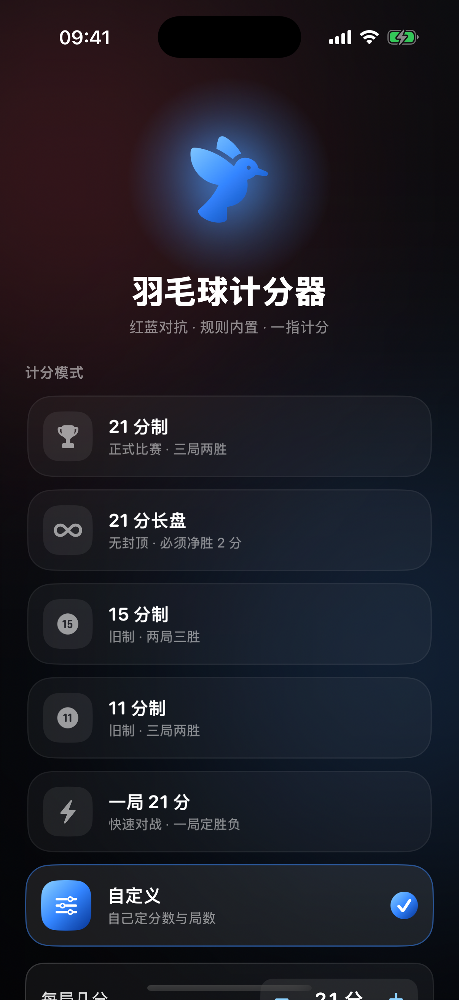
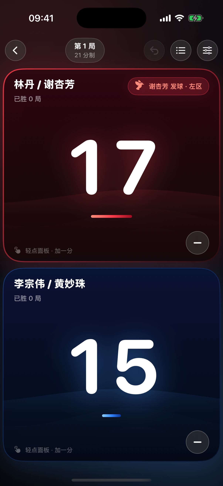
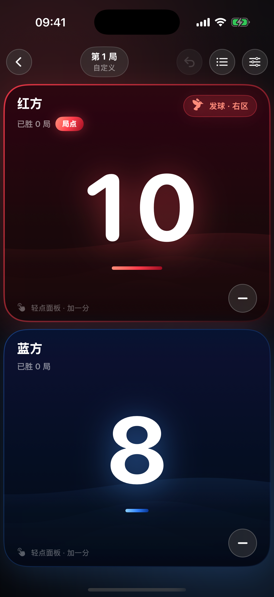
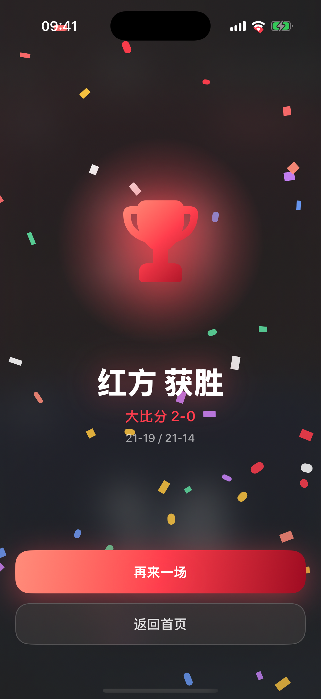
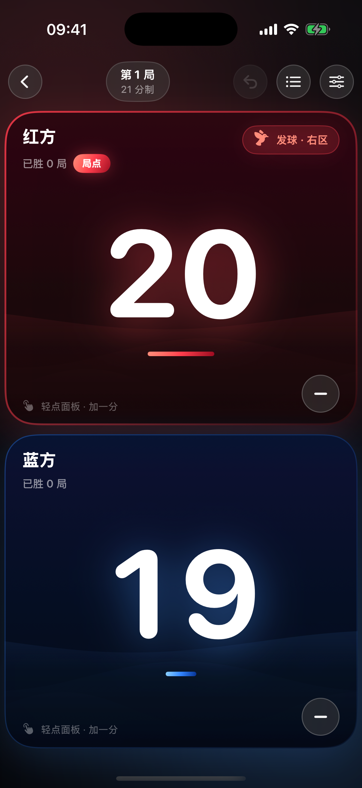
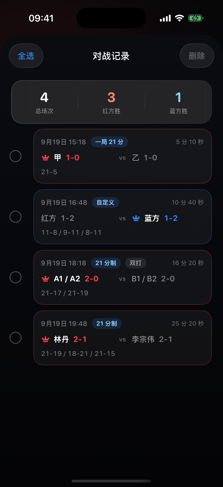

# 羽毛球计分器

一块屏幕上把比分记清楚。红蓝对抗、规则内置、一指计分。

iPhone 应用，纯 SwiftUI。**不联网、不要账号、不收集任何数据。**

| 首页 | 计分 | 双打 |
| :---: | :---: | :---: |
|  |  |  |

| 自定义规则 | 自定义赛制对局 | 胜出画面 |
| :---: | :---: | :---: |
|  |  |  |

| 赛点提示 | 对战记录 |
| :---: | :---: |
|  |  |

## 功能

### 六种计分模式

| 模式 | 规则 |
| :--- | :--- |
| **21 分制** | 现行 BWF 规则。三局两胜，20 平后净胜 2 分，29 平后 30 分封顶 |
| **21 分长盘** | 21 分制但不封顶，必须一直净胜 2 分 |
| **15 分制** | 旧制，发球得分。两局三胜，14 平后净胜 2 分，21 分封顶 |
| **11 分制** | 旧制，发球得分。三局两胜，10 平后净胜 2 分，15 分封顶 |
| **一局 21 分** | 快速对战，一局定胜负 |
| **自定义** | 自己定每局几分、要不要封顶、打几局 |

### 自定义规则

选「自定义」之后就地展开：

- **每局几分** —— 5 到 50
- **封顶** —— 可以关掉（必须净胜 2 分），也可以设成 目标分 +1 到 +20
- **打几局** —— 一局 / 三局 / 五局

面板底部实时显示规则概要，例如「3 局 2 胜 · 21 分 · 20 平后净胜 2 分 · 30 分封顶」。
改完立刻生效：比如把 21 改成 11，场上比分可能当场就分出胜负了。

### 单打 / 双打

双打每方两个人，发球按 BWF 轮转规则：

- 发球方连续得分 → **同一个人继续发**（左右发球区轮换）
- 接发球方夺回发球权 → **换这对里的另一个人发**

### 加减分

- **点面板任意位置加分** —— 整块面板都是按钮，不用瞄准小图标
- **点右下角的减号减分** —— 减分就是**撤回上一次加分**，加错了立刻能改

界面上会提示当前状态：`局点`、`赛点`、`发球 · 左区 / 右区`。

### 其他

- **到分自动判胜** —— 达到当前规则规定的分数后自动弹出胜出方，不用手动确认
- **撤销 / 重做** —— 最多回退 200 步，误操作随便退
- **对战记录** —— 打完一整场自动存一条：比分、用时、胜负，带统计
  - **向左滑**单条记录，右侧露出红色删除
  - 左上角**「选择」**进多选，**「全选」**一次选中全部，再一起删
- **逐分记录** —— 一局里每一分都能翻，按局分组
- **中途退出不怕丢** —— 比分实时存在本地，下次打开可以「继续上一场」

## 设计

- 纯深色界面，红蓝两色对应双方
- 玻璃面板 + 光晕，数字用 `.contentTransition(.numericText())` 滚动
- 每次得分都有触感反馈，得分 / 撤销 / 胜利用的是不同的触感
- 全屏动画用 `.snappy` 曲线

## 构建

需要 **Xcode 16+ / iOS 18+**。

```bash
open BadmintonScore.xcodeproj    # 用 Xcode 打开

./Tools/verify.sh                # 一条命令：编译 + 跑全部单元测试
```

### 测试

51 项单元测试，覆盖：

- 单局胜负判定（含 20 平、29 平、封顶）
- 局点与赛点
- 每球得分制 / 发球得分制的发球权
- 自定义规则的参数与边界（夹取、无封顶、局数换算）
- 双打发球轮转
- 比赛会话、撤销重做、切换赛制、改队名
- **对战记录**：自动记录、不重复记、没打完不记、再来一场能再记、自定义与双打也记、统计数字

```bash
SIM=<模拟器 UDID> ./Tools/verify.sh
```

### 调试用的预览参数

Debug 构建支持直接跳到指定画面，方便截图和联调：

```bash
xcrun simctl launch <UDID> com.alex.BadmintonScore -uiPreview match
```

可用值：`home` · `match` · `gamePoint` · `deuce` · `gameEnd` · `win` · `deuceWin` ·
`legacy15` · `custom` · `customMatch` · `doubles` · `records`

几个附加开关：

```bash
-uiPreview records -selectRecords   # 直接进对战记录的选择模式
```

## 结构

```
BadmintonScore/
  BadmintonScoreApp.swift   入口
  HomeView.swift            首页 + AppEntry（首页/计分页切换）+ 调试预览
  MatchView.swift           计分主界面
  Sheets.swift              下一局 / 逐分记录 / 赛制设置
  RecordsView.swift         对战记录
  CustomRulesView.swift     自定义规则编辑器
  ResultOverlay.swift       胜利画面
  Components.swift          数字 / 光晕 / 发球指示 / 触感按钮 / 彩带 …
  Theme.swift               配色与触感
  Scoring.swift             领域模型：双方、赛制、规则、比赛状态
  ScoreEngine.swift         纯函数计分引擎
  MatchStore.swift          会话状态：撤销重做、持久化、浮层
  MatchHistory.swift        对战记录存储
```

三层分离：**领域模型**（Scoring）→ **纯函数引擎**（ScoreEngine）→ **会话状态**（MatchStore）。
界面只负责展示和调用，所有规则变更都在引擎里完成，所以规则可以脱离 UI 单独测试。

## 许可证

[MIT](LICENSE)
